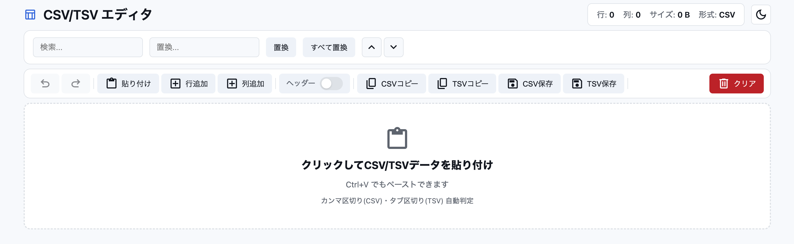

<p align="center">
  
</p>

<h1 align="center">ArtCSV</h1>

<p align="center">
  <strong>どこでも快適なCSV編集を。</strong><br />
  たった1つのHTMLファイルで動作する、インストール不要のCSV/TSVエディタ。
</p>

<p align="center">
  
  
  
  
</p>

<p align="center">
  
</p>

---

## 目次

- [概要](#概要)
- [特長](#特長)
- [デモ・使い方](#デモ使い方)
- [機能一覧](#機能一覧)
  - [データ入力](#データ入力)
  - [テーブル編集](#テーブル編集)
  - [列操作](#列操作)
  - [行操作](#行操作)
  - [検索・置換](#検索置換)
  - [ヘッダー行管理](#ヘッダー行管理)
  - [元に戻す・やり直し](#元に戻すやり直し)
  - [エクスポート](#エクスポート)
  - [列幅リサイズ](#列幅リサイズ)
  - [テーマ切替](#テーマ切替)
  - [データ永続化](#データ永続化)
- [キーボードショートカット](#キーボードショートカット)
- [CSV/TSV対応仕様](#csvtsv対応仕様)
- [技術構成](#技術構成)
- [プロジェクト構成](#プロジェクト構成)
- [開発方法](#開発方法)
- [設計思想](#設計思想)
- [リリースノート](#リリースノート)
- [ライセンス](#ライセンス)

---

## 概要

**ArtCSV** は、ブラウザ上で完結する軽量なCSV/TSVエディタです。

サーバー通信やトラッキングは一切行わず、すべてのデータ処理がブラウザ内で完結します。HTMLファイル1つで動作するため、USBメモリに入れても、自分のサーバーに置いても、どこでもすぐに使い始められます。

```
📦 ArtCSV.html (約54KB) — これ1つでCSV編集が完結
```

---

## 特長

| | 特長 | 説明 |
|---|---|---|
| 🔒 | **ローカル完結で安全** | すべての処理がブラウザ内で完結。データが外部に送信されることはありません。サーバー通信もトラッキングも一切なし。 |
| 📄 | **ファイル1つで完結** | 持ち運べるHTMLファイル1つだけ。USBメモリに入れても、自分のサーバーに置いても、どこでもすぐに使えます。 |
| ⚡ | **軽量で高速** | 大容量データでもストレスなく動作。最適化されたパース処理により、操作中のラグを徹底排除。 |
| 🌗 | **ダークモード対応** | ライト/ダーク切替をワンクリックで。設定はブラウザに保存され、次回以降も維持されます。 |
| 🇯🇵 | **日本語フレンドリー** | UIは全て日本語。ソート処理も日本語ロケールに対応しています。 |
| 💾 | **自動保存** | 編集データはlocalStorageに自動保存。ブラウザを閉じても作業を引き継げます。 |

---

## デモ・使い方

### Web版を使う

ランディングページから「Webで今すぐ使う」をクリックしてエディタを開きます。

### HTMLをダウンロードして使う

1. `ArtCSV.html` をダウンロード
2. ブラウザでファイルを開く
3. テキストエリアにCSV/TSVデータをペースト、またはCtrl+Vで貼り付け
4. 編集開始！

> **ヒント**: ダウンロードしたHTMLファイルはインターネット接続なしでも動作します（Material Symbolsアイコンを除く）。

---

## 機能一覧

### データ入力

- **ペーストゾーン**: 画面中央のエリアをクリック、またはCtrl+Vでデータを貼り付け
- **区切り文字の自動判別**: カンマ（CSV）とタブ（TSV）を自動で検出
- **RFC 4180準拠**: ダブルクォート内のカンマ・改行・エスケープに対応
- **改行コード**: CRLFおよびLFの両方に対応
- **列数の自動補完**: 行ごとに列数が異なる場合、最大列数に合わせて自動的に空セルを補完

### テーブル編集

- セルをクリックしてインライン編集
- セルの変更は自動保存（フォーカスが外れた時点で確定）
- 列ヘッダーのクリックでコンテキストメニューを表示
- 行番号のクリックでコンテキストメニューを表示

### 列操作

列ヘッダーのコンテキストメニューから以下の操作が可能です。

| 操作 | 説明 |
|---|---|
| **昇順ソート** | 列を昇順にソート。数値は数値順、テキストは日本語ロケール対応のlocaleCompareで比較 |
| **降順ソート** | 列を降順にソート |
| **列コピー** | 列全体をクリップボードにコピー（改行区切り） |
| **列を複製** | 選択列の右側に同じ内容の列を挿入 |
| **列を削除** | 確認ダイアログ表示後、列を削除 |

### 行操作

行番号のコンテキストメニューから以下の操作が可能です。

| 操作 | 説明 |
|---|---|
| **行コピー** | 行全体をTSV形式でクリップボードにコピー |
| **行を複製** | 選択行の下に同じ内容の行を挿入 |
| **行を削除** | 確認ダイアログ表示後、行を削除 |

### 検索・置換

- **リアルタイムハイライト**: 入力中に一致箇所をハイライト表示（大文字小文字を区別しない）
- **前後ナビゲーション**: 「前へ」「次へ」ボタンで一致箇所を順番に移動
- **置換**: 現在の一致箇所を1つだけ置換、または一括置換
- **マッチ情報**: 「3 / 15 件」のように現在位置と総マッチ数を表示
- **スコープ**: ヘッダー行が有効な場合、ヘッダーを除いたデータ行のみを検索

### ヘッダー行管理

- ツールバーのトグルスイッチでヘッダー行のON/OFFを切替
- ヘッダーON時: 1行目がヘッダーとして固定表示され、行番号は2行目から開始
- ヘッダーOFF時: 列番号（1, 2, 3...）が列名として表示
- ヘッダー設定は元に戻す・やり直しの対象

### 元に戻す・やり直し

- **Undo/Redo**: 最大20回分の操作履歴を保持
- 対象操作: セル編集、行/列の追加・削除・複製、ソート、置換、ヘッダー切替
- ツールバーのボタン、またはキーボードショートカットで操作
- 履歴が空の場合、ボタンは自動で無効化

### エクスポート

| 操作 | 形式 | 出力先 |
|---|---|---|
| **CSVコピー** | CSV（カンマ区切り） | クリップボード |
| **TSVコピー** | TSV（タブ区切り） | クリップボード |
| **CSVダウンロード** | CSV（UTF-8 BOM付き） | ファイル保存 |
| **TSVダウンロード** | TSV（UTF-8 BOM付き） | ファイル保存 |

- ファイル名の形式: `data_YYYY-MM-DD.csv` / `data_YYYY-MM-DD.tsv`
- 値にカンマ・改行・ダブルクォートを含む場合は適切にクォート処理

### 列幅リサイズ

- 列ヘッダーの境界をドラッグして列幅を調整（最小幅: 60px）
- 設定した列幅はlocalStorageに保存され、次回読み込み時に復元

### テーマ切替

- ヘッダー右上のトグルボタンでライト/ダークモードを切替
- OSのテーマ設定（`prefers-color-scheme`）を初期値として反映
- 選択したテーマはlocalStorageに保存

### データ永続化

- 編集中のデータは操作ごとにlocalStorageへ自動保存
- 保存対象: データ内容、ヘッダー状態、区切り文字、列幅
- ブラウザを再読み込みしても作業を継続可能
- ストレージ容量超過時のエラーハンドリングも実装済み

---

## キーボードショートカット

| ショートカット | 動作 |
|---|---|
| `Ctrl/Cmd + Z` | 元に戻す (Undo) |
| `Ctrl/Cmd + Y` | やり直し (Redo) |
| `Ctrl/Cmd + Shift + Z` | やり直し (Redo) |
| `Ctrl/Cmd + F` | 検索バーにフォーカス |
| `Tab` | 次のセルに移動 |
| `Shift + Tab` | 前のセルに移動 |
| `Enter` | 次の行に移動 |
| `Alt + ←↑→↓` | 上下左右のセルに移動 |
| `Escape` | 検索ハイライトをクリア |

---

## CSV/TSV対応仕様

### パース（読み込み）

- RFC 4180準拠のCSVパーサーを内蔵
- カンマ区切り（CSV）およびタブ区切り（TSV）の自動判別
- ダブルクォートによるフィールド囲み、エスケープ（`""` → `"`）に対応
- CRLF（`\r\n`）およびLF（`\n`）改行コードの両方をサポート
- フィールド内の改行（クォート内）もパース可能

### エクスポート（書き出し）

- 値にカンマ、ダブルクォート、改行のいずれかが含まれる場合、自動的にダブルクォートで囲む
- ダブルクォートのエスケープ（`"` → `""`）を適切に処理
- UTF-8 BOM付きでファイル出力（Excelでの文字化けを防止）

---

## 技術構成

### 使用技術

| カテゴリ | 技術 |
|---|---|
| エディタ本体 | HTML / CSS / Vanilla JavaScript（フレームワーク不使用） |
| ランディングページ | HTML / CSS / TypeScript |
| ビルドツール | TypeScript Compiler (`tsc`) |
| フォント | Noto Sans JP, Inter, Manrope（ランディングページのみ） |
| アイコン | Material Symbols Outlined |
| カラーシステム | oklch色空間 + `light-dark()` 関数 |
| CSSアーキテクチャ | `@layer`（Reset / Base / Component / Utility） |

### ブラウザAPI

| API | 用途 |
|---|---|
| Clipboard API | データのコピー・ペースト |
| Blob API | ファイルダウンロード |
| localStorage | データ・設定の永続化 |
| structuredClone | Undo/Redo用の状態ディープコピー |
| Intersection Observer | フェードインアニメーション（ランディングページ） |

### ランタイム依存関係

```
本番依存: 0
開発依存: TypeScript ^5.9.3 のみ
```

---

## プロジェクト構成

```
art-csv/
├── ArtCSV.html                  # エディタ本体（単独で動作するHTMLファイル）
├── index.html                   # ランディングページ
├── package.json                 # プロジェクト設定
├── tsconfig.json                # TypeScript設定
├── public/
│   ├── preview.png              # エディタのスクリーンショット
│   ├── css/
│   │   └── style.css            # ランディングページのスタイル
│   ├── js/
│   │   ├── main.js              # コンパイル済みJavaScript
│   │   └── main.js.map          # ソースマップ
│   └── favicon/
│       └── favicon.png          # ファビコン
└── src/
    └── main.ts                  # ランディングページのTypeScriptソース
```

### ファイルの役割

| ファイル | 説明 |
|---|---|
| `ArtCSV.html` | エディタ本体。HTML + CSS + JavaScriptが全て内包された単一ファイル。これ単独でCSV編集が可能 |
| `index.html` | プロジェクトのランディングページ。機能紹介やダウンロードリンクを提供 |
| `src/main.ts` | ランディングページのインタラクション（ダウンロード、アニメーション等）を記述したTypeScriptソース |
| `public/css/style.css` | ランディングページのスタイルシート。Material Design 3カラートークンベース |

---

## 開発方法

### セットアップ

```bash
git clone https://github.com/rita-rita24/art-csv.git
cd art-csv
npm install
```

### ビルド

```bash
# TypeScriptのコンパイル（src/main.ts → public/js/main.js）
npm run build

# ウォッチモード（ファイル変更時に自動コンパイル）
npm run watch
```

### ローカルでの確認

`index.html` または `ArtCSV.html` をブラウザで直接開くだけで動作します。ローカルサーバーの起動は不要です。

> **補足**: `ArtCSV.html` はエディタ本体のスタンドアロンファイルです。このファイルへの変更は直接HTML内のCSS/JavaScriptを編集してください。

---

## 設計思想

### 1. 単一ファイル配布

エディタのHTML・CSS・JavaScriptを1つのHTMLファイルに統合。外部依存なしで動作し、配布・持ち運びが容易。

### 2. プライバシーファースト

一切のサーバー通信を行わず、すべてのデータ処理をブラウザ内で完結。ユーザーのデータが外部に漏洩するリスクをゼロに。

### 3. パフォーマンス最適化

効率的なCSVパーサーと最小限のDOM操作により、大容量データでもスムーズに動作。

### 4. モダンCSS

CSS Cascade Layers (`@layer`) による明確なスタイル階層、oklch色空間による知覚的に均一な色彩設計、`light-dark()` 関数によるシームレスなテーマ切替。

### 5. アクセシビリティ

セマンティックなHTML構造、キーボードナビゲーション対応、レスポンシブデザインによるモバイル対応。

---

## リリースノート

### v1.2.0 — 2024-05-10

- ダークモードに対応
- テーマ設定の保持機能を追加

### v1.1.5 — 2024-03-22

- 50MBを超えるCSVファイルのパース性能を改善

---

## ライセンス

[ISC License](https://opensource.org/licenses/ISC)

© 2024 ArtCSV. 精密さを追求して。
