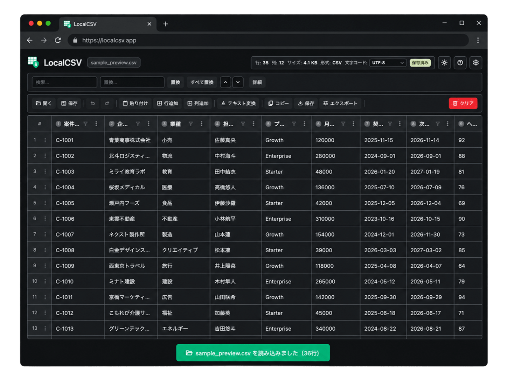

<div align="center">

# LocalCSV

**制約環境専用の CSV 実務エディタ**

ブラウザで開くだけ。インストール不要。CSV を一切外部に送信しない。
情シスの審査が一番通りやすい設計のまま、表形式での実務編集に必要な機能をひととおり備えました。

[](#セキュリティ設計)
[](#インストール)
[](#セキュリティ設計)
[](#ライセンス)

<a href="./LocalCSV.html"></a>

</div>

---

## 30秒で試す

1. このリポジトリの [`LocalCSV.html`](./LocalCSV.html) をダウンロード
2. ダブルクリックで開く（規定ブラウザで起動）
3. 開始画面の「ファイルを開く」、ドラッグ＆ドロップ、または `Ctrl + O` / `Cmd + O` で読み込み

手元にCSVがなくても「サンプルで操作を試す」で、架空の5件のデータを編集・検索・保存できます。
新規作成は「空の表を作る」、コピーしたテキストの読み込みは「貼り付けて読み込む」から始められます。

それだけです。インストーラなし、アカウント登録なし、外部通信なし。
共有フォルダ・USBメモリ・社内ポータル経由でも同じように動きます。

---

## なぜ LocalCSV を選ぶのか

### 1. 「IT審査の通り道」で勝てるように設計してあります

社内の標準ブラウザだけで動く **単一の HTML ファイル**。実行ファイル（.exe）でも、外部 SaaS でもないので、

- 情シスのソフトウェア導入申請が **桁違いに通りやすい**
- 社内ファイルサーバや SharePoint / Box にそのまま置けば **配布完了**
- 監査時にもソースコードを開いて **3分で内容確認**できる

「便利な CSV ツールはあるのに、現場では使えない」を終わらせます。

### 2. CSV を **絶対に** 外部送信しない（コードで強制）

ファイル冒頭の Content-Security-Policy で `connect-src 'none'`、`form-action 'none'` を宣言しています。
つまり、**たとえ作者が悪意をもって追記したとしても**、ブラウザ自身が外部送信をブロックします。
監査担当者にコードを見せれば、その場で「外部送信なし」を技術的に証明できます。

### 3. 表形式・列固定・差分プレビュー・正規表現置換を、ブラウザだけで

メモ帳・サクラエディタの「列がずれて見える地獄」も、Excel の「Shift_JIS が文字化け／先頭ゼロ落ち」も避けられます。
表で見て、必要な行だけ絞り、安全に直して、保存前に変更点を確認できます。

---

## 主な機能

### ファイル入出力

- **貼り付け読込**：専用画面でテキストと1行目ヘッダーの扱いを確認してから読み込みます。クリップボードの読み取り権限は不要です。失敗時は入力を保持して再試行でき、キャンセルした処理が後から表を置き換えることはありません。選択セルへの通常の貼り付けは `Ctrl + V` / `Cmd + V` です
- **読み込み中の操作**：ファイルの解析中は処理状態を表示し、重複実行を防ぎます。キャンセル後や別ファイルを開いた後に古い読み込み結果を反映しません。ドラッグ＆ドロップは1ファイルずつ対応し、開いているダイアログがある場合は閉じてから読み込みます
- **読み込み**：CSV / TSV / SSV / TXT、`.csv` 以外の拡張子もOK、ドラッグ＆ドロップ・クリップボードペースト対応。スペース区切りは連続空白を1つの区切りとして扱います
- **空セル・空行の保持**：末尾の引用空セル（`""`）も読み込みます。自動クオートでは1列の空行とスペース区切りの空セルを引用し、保存・エクスポート・TSVコピー後の再読み込みでも保持します。「クオートしない」で欠落が起きる場合は確認を表示します
- **置換確認**：既存データがある状態で読み込み・貼り付けインポート・インポートウィザード読み込みを行う場合は確認を表示。確定した置換は元に戻す/やり直すの対象
- **文字コード自動判定**：UTF-8（BOM有無を保存時も維持）, UTF-16 LE/BE（BOM有無）, **Shift_JIS, EUC-JP, ISO-2022-JP**。不正バイトや置換疑いがある場合は読み込み前に警告
- **書き出し形式**：CSV / TSV / SSV / TXT / JSON / NDJSON / HTML / Markdown、任意区切り文字、改行（CRLF / LF）、引用符ルールを選べるエクスポートウィザード
- **レガシー文字コード出力**：Shift_JIS / EUC-JP / ISO-2022-JP で表現できない文字がある場合は警告し、無警告の置換を避けます
- **選択エクスポート**：検索・フィルタで絞り込み中は表示中の行だけを対象
- **構造化出力**：JSON / NDJSON は重複ヘッダーを一意化し、Markdown は表セル内のパイプ・バックスラッシュ・改行をエスケープ。`空列を除外する` は見出しがある列を保持
- **式安全化**：表計算ソフト向けの式安全化では、先頭の空白・改行・NBSP・BOM に続く `=` `+` `-` `@` も検出してエスケープ
- **保存方式**：File System Access API による上書き/名前を付けて保存に対応し、保存ダイアログが使えない/失敗する環境では通常ダウンロードへフォールバック
- **保存中の編集**：保存・ダウンロード・コピーは処理開始時のデータと出力設定を使います。処理中の編集は次回の出力に含まれます。別ファイルを開いても、進行中の上書き保存の対象は切り替わりません。保存ボタンの連続実行による重複書き込みも防ぎます
- **保存先が分かる操作**：「上書き保存」「名前を付けて保存」「ダウンロード」を環境と開いているファイルに応じて区別し、保存中はボタンにも状態を表示します。保存候補名は元のファイル名を引き継ぎ、出力形式を変えた場合は拡張子を更新します

### 編集

- **表形式編集**：セル単位 / 行単位 / 列単位 / 範囲選択
- **表示行対象の操作**：検索・フィルタで絞り込み中の範囲選択 / 全選択 / 列選択、削除、テキスト変換、貼り付けは表示中の行だけを対象
- **絞り込みの再評価**：選択セルの削除・貼り付け・オートフィル・テキスト変換後に、検索結果と列フィルタを再評価
- **オートフィル**：選択範囲の右下フィルハンドルをドラッグして連続入力
- **ヘッダー表示**：1行目ヘッダーや仮想ヘッダーを有効化した時だけ、ヘッダー文字が見える幅まで列幅を自動拡張。拡張後も手動で縮小可能
- **行・列操作**：追加（上下/左右）、削除、複製、コピー、並べ替え（D&D）
- **仮想ヘッダー**：上部ツールバーの「仮想ヘッダー」ボタンから編集。ヘッダーなしCSVでもCSV本体を変えずに列の意味を表示し、名前付きプリセットとして保存・適用可能。JSON / NDJSON / HTML / Markdown などのエクスポートでは見出しとして利用可能
- **クリップボード**：セル範囲 / 列 / 行コピーは quoted TSV で、セル内タブ・改行・引用符を保持。通常の保存・コピー・ダウンロードは元値を維持し、表計算ソフト向けの式安全化はエクスポートウィザードの明示設定で適用
- **テキスト変換**：UPPER / lower / Title Case / Trim / 連続空白整形 / snake_case / camelCase / PascalCase / kebab-case / 全角⇄半角
- **元に戻す/やり直す**：履歴 20 段（フル / セル / セルバッチの3種類を効率良く保持）

### 検索・フィルタ・並べ替え

- **検索（`Ctrl + F`）**：通常文字列 / 正規表現、大文字小文字、単語単位
- **IME入力**：検索欄とコマンドパレットでは、日本語変換中の Enter / Escape を検索移動・履歴保存・コマンド実行として扱わない
- **置換**：1件ずつ / 一括。フィルタ表示中の一括置換は表示中の行だけを対象。通常検索置換では `$&` / `$1` / `$$` をリテラルとして扱い、正規表現ONでは `$1` などのキャプチャ置換に対応
- **絞り込みモード**：マッチしない行を非表示にしたまま編集
- **条件と復帰の案内**：「該当行のみ表示」を常時操作でき、検索条件・列フィルタ・表示件数をまとめて確認できます。0行になった場合も「検索・フィルタをすべて解除」で全行に戻せます。検索待ち・一致なし・無効な正規表現では置換と結果移動を無効化し、古い検索結果への操作を防ぎます
- **検索履歴**：直近20件をローカルに保持（IndexedDB）
- **列フィルタ**：チェックボックス選択、`=` `≠` `<` `>` `<=` `>=` `含む` `先頭一致` `末尾一致` の条件 + AND / OR
- **ソート**：列ごとに昇順 / 降順
- **大量データの表示・非同期処理**：表は仮想スクロールで描画し、検索・フィルタは **Web Worker** に逃がして、古い結果を破棄し UI が固まらないようにします

### コマンドパレット（`Ctrl + K` / `Cmd + K`）

開く・保存・元に戻す・検索・各種テキスト変換・テーマ切り替え・言語切り替え・ヘルプを **28コマンド** から横断検索。
覚えるショートカットを最小限にしたい人向けです。

### UI / 国際化

- **開始画面**：ファイル読込・貼り付け読込・空の表・サンプルを選べます。データがない間は保存やコピーなど実行できない操作を無効化します
- **キーボード操作**：行・列・テキスト変換メニューは `↑` / `↓`、`Home` / `End`、`Enter` / `Space` で操作し、`Esc` で閉じて元の位置へ戻れます。列フィルタも `Esc` で閉じられます。削除確認はキャンセルに初期フォーカスを置きます
- **操作の継続**：ダイアログを閉じた後やコピー後にフォーカスを戻し、表の再描画後も操作元を見失いにくくしています。ヘルプには基本操作と、表全体・選択範囲・絞り込み出力の違いを記載しています
- **日本語 / 英語**（約220キーを完全対応、起動時はブラウザ言語で自動選択）
- **ライト / ダークモード**：OS連動 + 手動切り替え
- **設定の永続化**：保存先は下記「保存先とプライバシー」に明記

### キーボードショートカット

| 操作 | キー |
|---|---|
| ファイルを開く | `Ctrl + O` / `Cmd + O` |
| 保存 | `Ctrl + S` / `Cmd + S` |
| コマンドパレット | `Ctrl + K` / `Cmd + K` |
| 検索 | `Ctrl + F` / `Cmd + F` |
| 元に戻す / やり直し | `Ctrl + Z` / `Ctrl + Y`（または `Ctrl + Shift + Z`） |
| コピー / 貼り付け | `Ctrl + C` / `Ctrl + V`（quoted TSV 対応） |
| ヘルプ | `?` |

---

## 保存先とプライバシー

- **CSV本体**：編集中データと出力設定は、ブラウザ内の IndexedDB（`csvEditorDB` / `kvStore` の `csvEditor_state_pro` と `csvEditor_state_pro::chunk::*`）に保存します。行チャンクは世代 ID とハッシュを持つ参照として保存し、復元時に不一致があれば自動復元を中止します。
- **自動保存の整合性**：保存開始時点の行データと設定を揃えて保存します。保存中に加わった編集は未保存として保持し、次回の自動保存に含めます。
- **保存表示の意味**：「ブラウザ内保存済み」は復元用データの保存状態です。元のCSVファイルは更新しません。ファイルに書き出すには「保存」またはエクスポートを使用してください。
- **閉じる前の保護**：入力中のセルや自動保存待ちの変更、進行中のファイル保存、メモリにしか保持できていないデータがある場合は、タブを閉じる・再読み込みする際にブラウザの確認を要求します。非表示になる際も入力中のセルを確定して保存を試みます。ブラウザやOSの強制終了などではこの処理が実行されないため、必要なデータはファイルにも保存してください。
- **起動時の復元**：前回の自動保存データがある場合も、起動直後に無条件表示せず、復元/破棄の確認後に反映します。
- **全データクリア**：自動保存データと検索履歴の削除成功後に表を空にします。永続化データの削除に失敗した場合は表を保持し、現在のデータ・列幅・検索履歴の再保存を試みたうえで未削除であることを通知します。
- **検索履歴**：直近20件を IndexedDB の `csvEditor_searchHistory` に保存します。
- **設定**：テーマ・アクセント・言語・ステータスバー表示は IndexedDB、列幅は localStorage の `csvEditor_columnWidths` に保存します。
- **仮想ヘッダー**：現在のCSVに適用した列ラベルは自動保存データに含め、名前付きプリセットは localStorage の `csvEditor_virtualHeaderPresets` に保存します。プリセットは全データクリア後も設定として残り、仮想ヘッダー画面から個別に削除できます。
- **フォールバック**：IndexedDB が使えない場合は localStorage、localStorage も使えない場合はメモリのみで同一タブ中だけ動作します。IndexedDB が再び使える状態になった場合は、localStorage の保存データと行チャンクを IndexedDB へ移行し、既存の IndexedDB データがある場合は保存時刻の新しい側を採用します。メモリのみの場合、再読み込み・再起動後の復元は保証されません。
- **容量不足時**：保存できなかった値は同じタブ内の最新値を優先して読み戻し、古い localStorage の値に戻さないようにします。一部の行チャンクがメモリにしか保持されていない場合は、後続の小さな設定データが保存できても「一時保持のみ・要書き出し」を維持します。
- **外部送信なし**：CSV本体、検索履歴、設定を外部サーバーへ送信しません。アクセス解析、広告タグ、外部トラッキングスクリプトも使用しません。

---

## 競合との比較

| 観点 | メモ帳 / 汎用エディタ | Excel | 外部Webツール | デスクトップ有償 (exe) | **LocalCSV** |
|---|:---:|:---:|:---:|:---:|:---:|
| 表形式で編集 | ✕ | ◎ | ◯ | ◎ | **◎** |
| Shift_JIS を壊さない | △ | ✕ | ◯ | ◯ | **◎** |
| 先頭ゼロ落ちしない | ◯ | ✕ | ◯ | ◯ | **◎** |
| 列固定 / フィルタ / 差分 | ✕ | ◯ | ◯ | ◎ | **◯** |
| 一括置換（正規表現） | △ | △ | ◯ | ◎ | **◎** |
| **CSV を外部送信しない** | ◎ | ◎ | **✕** | ◎ | **◎（CSPで強制）** |
| **インストール不要** | ◎ | ✕ | ◎ | ✕ | **◎** |
| **IT審査が通りやすい** | ◎ | ◎ | △ | ✕ | **◎** |
| **アップロード禁止の現場で使える** | ◎ | ◎ | **✕** | ◎ | **◎** |

「全部入り」を狙ったのではなく、**実務で本当に詰まるポイント**だけを重点的に潰してあります。

---

## 利用シーン

- **マスタCSVの一括メンテ**：数百〜数千行から該当行だけフィルタして一括置換
- **データ移行前の整形**：列順入れ替え、文字コード変換、改行コード統一
- **業務システムからのエクスポート確認**：Shift_JIS で吐かれた CSV をそのまま開いて検証
- **Web フォーム投入用CSVの整形**：JSON / NDJSON へ書き出して API へ
- **手順書・台帳のCSV化**：Markdown / HTML へ書き出し

---

## セキュリティ設計

LocalCSV は「業務データを開く前提」のツールです。**信頼できることをコードで証明する**設計にしています。

```html
<meta http-equiv="Content-Security-Policy"
  content="default-src 'self';
           script-src 'self' 'unsafe-inline' blob:;
           style-src 'self' 'unsafe-inline';
           font-src 'self' data:;
           img-src 'self' data: blob:;
           connect-src 'none';
           object-src 'none';
           base-uri 'none';
           form-action 'none';
           worker-src 'self' blob:">
<meta name="referrer" content="no-referrer">
```

- `connect-src 'none'`：外部API・サードパーティへの fetch / XHR / WebSocket / Beacon を **ブラウザがブロック**
- `form-action 'none'`：フォーム送信先も **物理的に存在しない**
- `object-src 'none'` / `base-uri 'none'`：プラグイン・ベースURL書き換え攻撃も封じる
- `referrer 'no-referrer'`：万一の漏えい経路を遮断

ファイルを読み込んだ後の処理はすべてブラウザ内で完結します。テレメトリ・分析・広告タグは一切埋め込まれていません。

---

## 動作環境

- **推奨ブラウザ**：Chrome / Edge / Firefox / Safari の現行版
- **OS**：Windows 10 以降、macOS 12 以降、主要Linux
- **想定データ規模**：数千〜数万行（仮想スクロールは実装済み。10万行超の定常運用はブラウザ・列数・セル内容に依存するため、事前検証を推奨）
- **インターネット接続**：**不要**（初回ファイル取得後はオフラインで動作）

---

## 対応形式まとめ

### 入力（自動判定）

| カテゴリ | 内容 |
|---|---|
| 区切り文字 | カンマ / タブ / セミコロン / 空白（連続空白は1区切り）/ 任意の文字 |
| 文字コード | UTF-8 / UTF-16 LE / UTF-16 BE（BOMの有無を自動）/ Shift_JIS / EUC-JP / ISO-2022-JP |
| 改行 | CRLF / LF / CR の混在も許容 |
| 引用符 | ダブルクォート、エスケープ済みクォート |

### 出力

| 形式 | 用途 |
|---|---|
| CSV / TSV / SSV / TXT | そのまま他ツールへ受け渡し |
| 任意区切り | パイプ区切りなど業務固有要件に対応 |
| JSON / NDJSON | API 投入、ストリーミング処理 |
| HTML | 報告書添付・社内ポータル掲示 |
| Markdown | Wiki・GitHub・Backlog・Notion |

---

## 価格・ライセンス

| プラン | 用途 | 価格（税込） |
|---|---|---|
| Free | 個人利用・社内検証 | 無料 |
| Pro（買い切り） | 商用利用・社内配布 | **¥4,980 / ユーザー** |

国内では無料CSVエディタが強いため、初期価格は低単価の買い切りに寄せています。
継続的な業務利用や社内配布は Pro を利用人数分ご購入いただく想定です。
詳細・購入は[公式LP](./index.html)からお願いします。

---

## LP補足（index.html）

- `index.html` は Google Fonts などの外部フォント取得を行わず、システムフォントと同梱フォントだけで表示します。
- LP側にも Content-Security-Policy を設定し、外部ドメインへのスクリプト・スタイル・フォント・画像取得をブロックします。`base-uri 'none'` も本体HTMLと同じ方針に揃えています。
- フッターの `動作環境` `利用規約` `プライバシーポリシー` はモーダルで表示されます。
- フッターの `お問い合わせ` リンクは設置していません。

---

## デザインシステム

LocalCSV の画面設計は、実務ツール向けの ClearLeaf UI を基準にしています。

- [`DESIGN.md`](./DESIGN.md)：ClearLeaf UI の設計方針、禁止パターン、トークン規律、コンポーネント仕様
- [`clearleaf-ui.css`](./clearleaf-ui.css)：OKLCH トークン、ライト/ダーク、アクセント、`.cl-*` コンポーネント
- [`public/fonts/material-symbols-outlined-f400.woff2`](./public/fonts/material-symbols-outlined-f400.woff2)：同梱 Material Symbols フォント

他システムへ移植する場合は `clearleaf-ui.css` を読み込み、対象のルート要素に `class="cl-root"` を付与してください。

---

## ロードマップ

- [ ] 行数上限・置換回数の Demo / Pro ゲート（コードレベル）
- [ ] 10万行超データの実測検証・チューニング
- [ ] 列固定（Pin Column）の本実装
- [ ] 差分プレビューモードの強化
- [ ] PWA インストール対応（オフライン更新）
- [ ] 法人向け配布パッケージ（社内利用ガイド・FAQ・配布手順書 PDF）

---

## FAQ

**Q. 社内PCで使えますか？**
A. 標準ブラウザがあれば動きます。実際に使えるかは社内ルール次第なので、まずは無料デモを社内のテスト環境で開いてみてください。

**Q. CSV は外部に送信されませんか？**
A. 送信しません。CSV本体はブラウザ内で処理し、復元用データは IndexedDB（`csvEditor_state_pro` とチャンク）に保存します。検索履歴は `csvEditor_searchHistory`、設定は IndexedDB と列幅・仮想ヘッダープリセット用 localStorage に保存します。

**Q. 「本体HTMLソースをコピー」は何をコピーしますか？**
A. `LocalCSV.html` の全文です。LP表示用コードではなく、実際に動作するエディタ本体をコピーします。

**Q. Shift_JIS の CSV は扱えますか？**
A. 入力は自動判定で対応します。書き出し時に Shift_JIS / EUC-JP / ISO-2022-JP で表現できない文字があれば警告し、無警告で置換しません。

**Q. 何行まで開けますか？**
A. 数千〜数万行を想定して動作確認しています。表描画は仮想スクロール済みですが、10万行クラスの定常運用はブラウザ・列数・セル内容に依存するため、事前検証を推奨します。

**Q. オフラインで使えますか？**
A. 初回にこの HTML ファイルを取得したあとは、完全にオフラインで動きます。

**Q. ライセンスは？**
A. プロプライエタリ（買い切り）です。継続的な業務利用や社内配布では、Pro を利用人数分ご購入ください。

---

## 開発者向けノート

LocalCSV は **単一 HTML ファイル** という配布形態を最優先する設計指針で書かれています。
ビルドステップ、ランタイム依存パッケージ、外部CDNは導入しません。

- **CSS**：`reset → base → component → utility` の `@layer` 構成、`oklch` ベースカラー、ネストCSS
- **JavaScript**：単一ファイルで完結、依存ゼロ、Web Worker は `blob:` URL から動的生成
- **永続化**：CSV本体は IndexedDB チャンク保存、検索履歴は IndexedDB、設定は IndexedDB と列幅・仮想ヘッダープリセット用 localStorage。IndexedDB 不可時のみ localStorage へフォールバック
- **i18n**：軽量な内製 dictionary + MutationObserver による DOM 動的翻訳
- **回帰テスト**：`npm test` で、CSV/TSV/SSVの往復・保存競合・復元・離脱保護に加え、開始画面、貼り付けの取消と再試行、検索待機中の操作、フィルタ全解除、メニューとダイアログのフォーカス、ファイル名の引継ぎ、読み込みの取消、配布用HTMLの同期を検証
- **検証範囲**：回帰テストは本体HTMLから実装を取り出して実行し、ストレージやファイル書き込みの待機・失敗を再現します。ブラウザUIの統合テストではありません。リリース前には対象ブラウザで、ファイルを開く→編集→保存→再読み込み、復元確認、離脱確認、保存ダイアログの取消も確認してください

詳しいコーディング規約は [`AGENTS.md`](./AGENTS.md) を参照してください。

---

## English Summary

**LocalCSV** is a CSV editor that runs entirely in your browser as a **single HTML file** — no installation, no account, no external network calls.
It is designed for locked-down corporate environments where `.exe` installers are blocked, web SaaS uploads are forbidden, and Notepad / generic editors are the only fallback.

Key properties:

- Single HTML file — easy to distribute via shared drive or USB, easy for IT review
- `connect-src 'none'` CSP enforces no outbound network access at the browser level
- Reads/writes UTF-8, UTF-16, Shift_JIS, EUC-JP, ISO-2022-JP
- Table editing with virtualized rendering, virtual headers for headerless CSVs, column filter, regex find/replace, sort, autofill, undo/redo, dark mode
- Japanese / English UI

This README and the codebase are written primarily for the Japanese enterprise market.
For licensing or business inquiries, please open a GitHub issue or contact the maintainer.

---

<div align="center">

**メモ帳で CSV を直す時間を、今日で終わらせませんか。**

[`LocalCSV.html` をダウンロード](./LocalCSV.html) ・ [公式LPを見る](./index.html) ・ [デザインシステム](./DESIGN.md)

</div>
