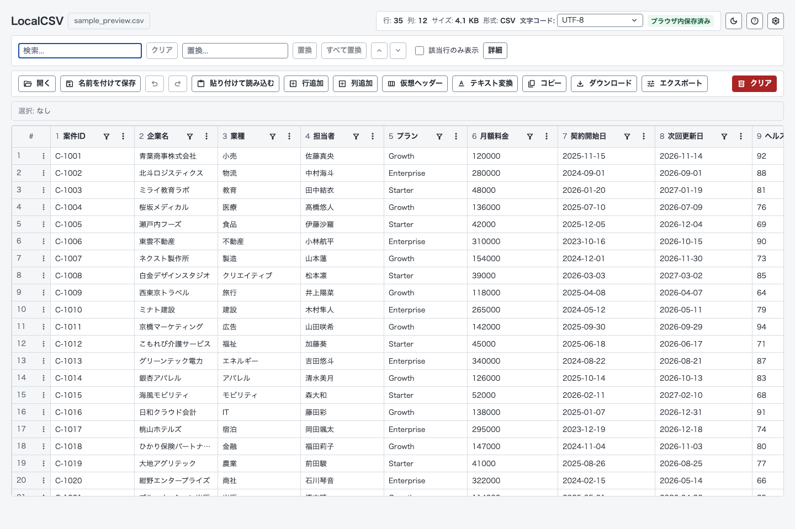
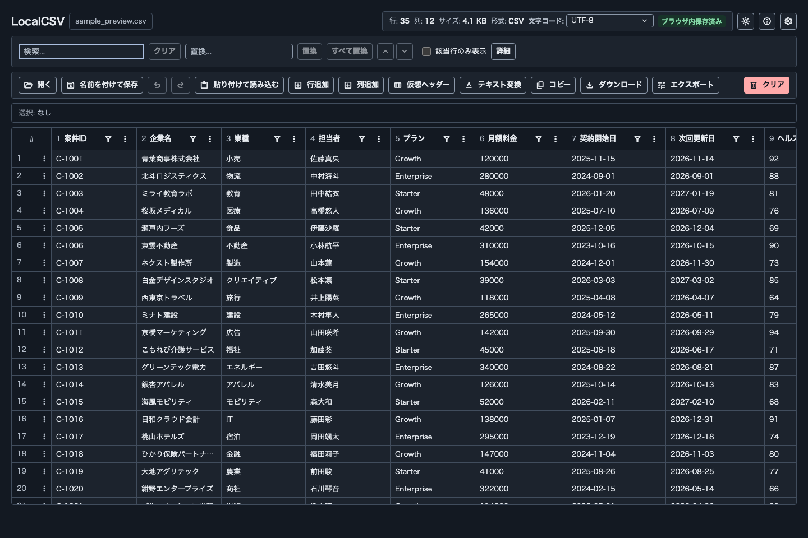

<div align="center">

# LocalCSV

**制約環境専用の CSV 実務エディタ**

ブラウザで開くだけ。インストール不要。CSV を一切外部に送信しない。
情シスの審査が一番通りやすい設計のまま、表形式での実務編集に必要な機能をひととおり備えました。

[](#セキュリティ設計)
[](#30秒で試す)
[](#セキュリティ設計)
[](#価格ライセンス)

<a href="./LocalCSV.html"></a>

</div>

---

## 30秒で試す

1. このリポジトリの [`LocalCSV.html`](./LocalCSV.html) をダウンロード
2. ダブルクリックで開く（既定ブラウザで起動）
3. ツールバーの「開く」、ドラッグ＆ドロップ、または `Ctrl + O` / `Cmd + O` で読み込み

コピーしたテキストは、中央の貼り付けエリアをクリックして読み込むか、`Ctrl + V` / `Cmd + V` で直接貼り付けられます。
空の表から始める場合は、ツールバーの「行追加」または「列追加」を使います。

それだけです。インストーラなし、アカウント登録なし、外部通信なし。
共有フォルダ・USBメモリ・社内ポータル経由でも同じように動きます。

### 現在のUI

`LocalCSV.html` に業務UIを組み込んでいます。本体HTMLひとつで起動でき、スタイル・アイコン・スクリプトの追加取得は不要です。

- ヘッダーで文字コードとライト／ダークを切り替え、設定でアクセントカラー・表示言語・ステータスバーを変更できます。
- 検索条件と「検索・フィルタをすべて解除」は「詳細」にまとめています。
- 選択セルは範囲の外周を強調します。行・列のメニュー、列幅変更、仮想ヘッダー、仮想スクロールに対応しています。
- エクスポートは形式・表計算安全モード・ヘッダー行・空行／空列の扱いを確認して出力します。狭い画面では設定を1列に並べます。
- ドラッグによるオートフィルは搭載していません。

冒頭の画像は [`public/sample_preview.csv`](./public/sample_preview.csv) を読み込み、設定でステータスバーを表示した実画面です。

<details>
<summary>ダークモードのスクリーンショット</summary>



</details>

---

## なぜ LocalCSV を選ぶのか

### 1. 「IT審査の通り道」で勝てるように設計してあります

社内の標準ブラウザだけで動く **単一の HTML ファイル**。実行ファイル（.exe）でも、外部 SaaS でもないので、

- 情シスのソフトウェア導入申請が **桁違いに通りやすい**
- 社内ファイルサーバや SharePoint / Box にそのまま置けば **配布完了**
- 監査時にもソースコードを開いて **3分で内容確認**できる

「便利な CSV ツールはあるのに、現場では使えない」を終わらせます。

### 2. CSV を **絶対に** 外部送信しない（コードで強制）

ファイル冒頭の Content-Security-Policy で `connect-src 'none'`、`form-action 'none'` を宣言しています。
この設定により、fetch / XHR / WebSocket / Beacon とフォーム送信をブラウザがブロックします。
監査時にはCSPと実装を確認できます。配布後にHTML自体を書き換えた場合は、変更後の内容を確認してください。

### 3. 表形式・列固定・差分プレビュー・正規表現置換を、ブラウザだけで

メモ帳・サクラエディタの「列がずれて見える地獄」も、Excel の「Shift_JIS が文字化け／先頭ゼロ落ち」も避けられます。
表で見て、必要な行だけ絞り、安全に直して、保存前に変更点を確認できます。

---

## 主な機能

### ファイル入出力

- **貼り付け読込**：専用画面でテキストと1行目ヘッダーの扱いを確認してから読み込みます。クリップボードの読み取り権限は不要です。失敗時は入力を保持して再試行でき、キャンセルした処理が後から表を置き換えることはありません。選択セルへの通常の貼り付けは `Ctrl + V` / `Cmd + V` です
- **読み込み中の操作**：ファイルの解析中は処理状態を表示し、重複実行を防ぎます。キャンセル後や別ファイルを開いた後に古い読み込み結果を反映しません。ドラッグ＆ドロップは1ファイルずつ対応し、開いているダイアログがある場合は閉じてから読み込みます
- **読み込み**：CSV / TSV / SSV / TXT、`.csv` 以外の拡張子もOK、ドラッグ＆ドロップ・クリップボードペースト対応。スペース区切りは連続空白を1つの区切りとして扱います
- 通常のファイル選択では、非表示の入力要素を選択中だけ保持し、選択・キャンセル・読込失敗後に取り除きます。
- **区切り文字の判定**：スペース区切りの引用セルに含まれるカンマ・セミコロン・タブ・改行を区切りとして数えません。引用した1列の文章に含まれる空白も判定から除外します
- 判定用のサンプルは引用セルの途中で打ち切らず、先頭セルに多数の改行がある場合も、その後の区切り文字を確認します。
- **空セル・空行の保持**：末尾の引用空セル（`""`）も読み込みます。自動クオートでは1列の空行とスペース区切りの空セルを引用し、保存・エクスポート・TSVコピー後の再読み込みでも保持します。「クオートしない」で欠落が起きる場合は確認を表示します
- **置換確認**：既存データがある状態で読み込み・貼り付けインポート・インポートウィザード読み込みを行う場合は確認を表示。確定した置換は元に戻す/やり直すの対象
- **文字コード自動判定**：UTF-8（BOM有無を保存時も維持）, UTF-16 LE/BE（BOM有無）, **Shift_JIS, EUC-JP, ISO-2022-JP**。不正バイトや置換疑いがある場合は読み込み前に警告
- BOMはファイル先頭の1つだけを取り除き、その後にセル内容として続くU+FEFFは保持します。
- **書き出し形式**：CSV / TSV / SSV / TXT / JSON / NDJSON / HTML / Markdown、任意区切り文字、改行（CRLF / LF）、引用符ルールを選べるエクスポートウィザード
- **レガシー文字コード出力**：Shift_JIS / EUC-JP / ISO-2022-JP で表現できない文字がある場合は警告し、無警告の置換を避けます
- **選択エクスポート**：検索・フィルタで絞り込み中は表示中の行だけを対象
- 選択範囲のプレビューでは、先頭200行だけセル値を複製して負荷を抑えます。選択中の全セルを座標オブジェクトへ変換する中間処理も省きます。コピー・ダウンロード時は対象の全行を出力します。
- 空行・空列を除外する場合、プレビューも対象全体で除外を判定してから先頭200行を表示します。先頭200行が空でも後続のデータを表示し、201行目以降に値がある列を誤って省略しません。
- HTML出力は、見出し・セル内のCRとCRLFを文字参照で保持し、HTMLとして開き直した際のLFへの変化を防ぎます。
- HTML / Markdownの文字エスケープは文字列だけで処理し、セルごとの一時DOM生成を避けます。HTMLとして解釈される記号のエスケープは維持します。
- **構造化出力**：JSON / NDJSON は重複ヘッダーを一意化し、`__proto__` などの特殊な列名もキーと値を保持。Markdown は表セル内のパイプ・バックスラッシュ・改行をエスケープ。`空列を除外する` は見出しがある列を保持
- Markdownでは強調・コード・リンク・打ち消し線に使う記号もエスケープし、セルの文字が書式として解釈されるのを防ぎます。
- **式安全化**：表計算ソフト向けの式安全化では、先頭の空白・改行・NBSP・BOM に続く `=` `+` `-` `@` も検出してエスケープ
- **保存方式**：File System Access API による上書き/名前を付けて保存に対応し、保存ダイアログが使えない/失敗する環境では通常ダウンロードへフォールバック
- ファイルへの書き込み・確定に失敗した場合は、開いた書き込みストリームの中止を試みてから既存の代替保存へ進みます。
- **保存中の編集**：保存・ダウンロード・コピーは処理開始時のデータと出力設定を使います。処理中の編集は次回の出力に含まれます。別ファイルを開いても、進行中の上書き保存の対象は切り替わりません。保存ボタンの連続実行による重複書き込みも防ぎます
- **保存先が分かる操作**：「上書き保存」「名前を付けて保存」「ダウンロード」を環境と開いているファイルに応じて区別し、保存中はボタンにも状態を表示します。保存候補名は元のファイル名を引き継ぎ、出力形式を変えた場合は拡張子を更新します

### 編集

- **表形式編集**：セル単位 / 行単位 / 列単位 / 範囲選択
- 読み込んだNUL文字（U+0000）を表の再描画や検索ハイライトで失わず、セルを選んだだけで元データから削除することを防ぎます。
- セルはプレーンテキストとして編集します。CSVに保存できない太字・斜体などの書式は付けず、セル内改行・検索ハイライト・Undoは維持します。
- 検索ハイライトの末尾でShift + Enterを押した場合も、続く文字との間の改行をコピー・保存・Undo / Redoで保持します。
- Shift + Enterは1回につき1つの改行を挿入します。ブラウザがカーソル表示用に追加する末尾要素を値から除外し、途中や末尾の意図した改行は保持します。
- **表示行対象の操作**：検索・フィルタで絞り込み中の範囲選択 / 全選択 / 列選択、削除、テキスト変換、貼り付けは表示中の行だけを対象
- **絞り込みの再評価**：選択セルの削除・貼り付け・テキスト変換後に、検索結果と列フィルタを再評価
- 範囲削除・貼り付けでは、表示中のセルをまとめて更新し、画面外のセルごとのDOM検索を避けます。全行の編集結果とUndo / Redoは維持します。
- **ヘッダー表示**：1行目ヘッダーや仮想ヘッダーを有効化した時だけ、ヘッダー文字が見える幅まで列幅を自動拡張。拡張後も手動で縮小可能
- 列幅の変更やドラッグ中に別ウィンドウ・タブへ移った場合は、列幅をその位置で確定し、未完了の範囲選択・並べ替えを中断します。戻ってからマウスを動かしても操作が勝手に続きません。幅を動かしていない場合は不要な保存を行いません。
- **行・列操作**：追加（上下/左右）、削除、複製、コピー、並べ替え（D&D）
- **行・列操作の整合性**：操作前に入力中のセルを確定し、Undoでも入力値を保持します。列の挿入・移動・複製では検索対象の列を追従させ、仮想ヘッダーも複製します。表の構造を戻した際には古い選択範囲とドラッグ状態を解除し、削除や貼り付けで存在しない列が混入することを防ぎます。
- **仮想ヘッダー**：上部ツールバーの「仮想ヘッダー」ボタンから編集。ヘッダーなしCSVでもCSV本体を変えずに列の意味を表示し、名前付きプリセットとして保存・適用可能。JSON / NDJSON / HTML / Markdown などのエクスポートでは見出しとして利用可能
- **クリップボード**：セル範囲 / 列 / 行コピーは quoted TSV で、セル内タブ・改行・引用符を保持。通常の保存・コピー・ダウンロードは元値を維持し、表計算ソフト向けの式安全化はエクスポートウィザードの明示設定で適用
- 表セルへの貼り付けはテキストだけを処理します。テキストを含まないHTMLのみのクリップボードは表を変更せず、空白やTSVの空セルは保持します。
- **テキスト変換**：UPPER / lower / Title Case / Trim / 連続空白整形 / snake_case / camelCase / PascalCase / kebab-case / 全角⇄半角
- **元に戻す/やり直す**：履歴 20 段（フル / セル / セルバッチの3種類を効率良く保持）
- セルに入力したままキーボードでUndo / Redoしても、再描画時のフォーカス解除で古い入力を再保存しません。画面・検索・コピー・保存の値と履歴を一致させます。
- セル入力直後にShiftで範囲選択してDelete / Backspaceで消した場合も、元に戻すと消す直前の入力値を復元します。
- 集計にはフォーカス中のセルの入力値も即時反映します。入力確定や履歴追加は行わず、数値がない場合は合計・平均・最小・最大を非表示にします。
- **選択範囲の集計**：ステータスバーの合計・平均・最小・最大は、長い整数や小数の桁を保って計算し、表示時だけ小数点以下6桁まで丸めます。絞り込み中の行数は選択された表示行を数え、貼り付けや再描画後も集計を更新します。

### 検索・フィルタ・並べ替え

- 列フィルタのAND / ORは、その列に保存した条件から復元します。キャンセルした設定が別の列へ残ることを防ぎます。
- 大量データのフィルタ適用・解除が遅れて完了しても、後から開いた別の列のパネルや入力を閉じません。再描画後もパネルの開閉状態とキーボードのフォーカス復帰先を保ちます。

- **検索（`Ctrl + F`）**：通常文字列 / 正規表現、大文字小文字、単語単位
- 通常検索・ハイライト・置換は、Unicodeの大文字小文字を同じ基準で判定します。少量データとWorker処理の両方で、検索結果と置換対象を揃えます。
- **IME入力**：検索欄とコマンドパレットでは、日本語変換中の Enter / Escape を検索移動・履歴保存・コマンド実行として扱わない
- **置換**：1件ずつ / 一括。フィルタ表示中の一括置換は表示中の行だけを対象。通常検索置換では `$&` / `$1` / `$$` をリテラルとして扱い、正規表現ONでは `$1` などのキャプチャ置換に対応
- **完全一致の整合性**：末尾改行を含むセルは、改行を含まない検索語の完全一致置換では変更しません。正規表現の選択肢や最短一致も、セル全体に一致するかを検索・置換で揃えて判定します。
- **処理中の入力保護**：並べ替え・一括置換の処理中に入力したセルは、フォーカスが残っていても確定して保護します。処理中に編集があった場合は古い結果を破棄し、入力が別の行へ移ることを防ぎます。置換の処理が失敗した場合も、取り消された検索条件で置換を続けません。
- 検索・フィルタの解除前にも編集中のセルを確定します。絞り込み中にEscapeで選択と検索を解除しても入力を失わず、Undo / Redoで戻せます。テキスト変換・行コピー・列コピー・置換もフォーカス移動に依存せず入力を確定します。
- **再描画時の入力保護**：仮想スクロール、検索結果の反映、列フィルタの更新前に入力中の値を確定し、履歴と自動保存へ反映します。日本語変換中はこれらの再描画を保留し、変換終了後に再開します。仮想スクロールの再描画後もスクロール位置を維持します。全データ削除の待機中に入力した値も、フォーカス移動の有無によらず保持します。
- **絞り込みモード**：マッチしない行を非表示にしたまま編集
- **条件と復帰の案内**：「該当行のみ表示」を常時操作でき、検索条件・列フィルタ・表示件数をまとめて確認できます。0行になった場合も「検索・フィルタをすべて解除」で全行に戻せます。検索待ち・一致なし・無効な正規表現では置換と結果移動を無効化し、古い検索結果への操作を防ぎます
- **検索履歴**：直近20件をローカルに保持（IndexedDB）
- **列フィルタ**：チェックボックス選択、`=` `≠` `<` `>` `<=` `>=` `含む` `先頭一致` `末尾一致` の条件 + AND / OR
- 値一覧の読み込み中も既存の選択と「すべて選択／解除」を保持します。開き直した際に前の値検索や古い読み込み結果を持ち越さず、複数列で絞り込み中の再適用でも未選択の値を含めません。
- **ソート**：列ごとに昇順 / 降順
- **数値の精度**：並べ替えと大小比較フィルタは、長い整数・小数・指数表記を丸めずに比較します。数値と文字列が混在する列は、昇順では数値群、文字列群の順に並びます。同値の数値は元の順序を保ちます。
- **正規表現の停止**：検索・ハイライト範囲の計算・置換は小さい表でも Worker 内で実行し、2秒を超えた処理を中止します。中止後は既存の検索エラー表示に戻り、検索条件を変えて再実行できます。
- **セル移動と改行**：フィルタ中の Enter / Tab / Alt + 上下キーは表示中の行を移動します。Shift + Enter で入力したセル内改行を保存・書き出しでも保持します。
- 最後のセルでTab、最初のセルでShift + Tabを押すと、ブラウザの通常の順序でセルの外へ移動できます。移動前の入力も確定します。
- **セル移動後のコピー・貼り付け**：Enter / Tab / Alt + 矢印キーでは選択範囲も移動先のセルへ揃えます。続けてコピー・貼り付け・Shift + クリックを行う際に、移動前のセルを対象にしません。
- **確認処理**：ファイル再読込など、ダイアログ内から開く確認画面も開いた順に操作できるようにし、背面に隠れて進めなくなることを防ぎます。
- **大量データの表示・非同期処理**：表は仮想スクロールで描画し、検索・フィルタは **Web Worker** に逃がして、古い結果を破棄し UI が固まらないようにします

### コマンドパレット（`Ctrl + K` / `Cmd + K`）

開く・保存・元に戻す・検索・各種テキスト変換・テーマ切り替え・言語切り替え・ヘルプを **28コマンド** から横断検索。
覚えるショートカットを最小限にしたい人向けです。

### UI / 国際化

- **開始画面**：`LocalCSV.html` は9月11日の変更前と同じ、中央寄せの貼り付け案内に戻しました。開始画面の追加ボタン・説明文・内蔵サンプルを取り除き、配色・全体の余白と読み込み・保存の不具合修正は維持しています。貼り付けエリアはクリック・Enter・Spaceで開けます。データがない間は保存やコピーを無効化し、行追加・列追加から新規作成できます
- **キーボード操作**：行・列・テキスト変換メニューは `↑` / `↓`、`Home` / `End`、`Enter` / `Space` で操作し、`Esc` で閉じて元の位置へ戻れます。列フィルタも `Esc` で閉じられます。削除確認はキャンセルに初期フォーカスを置きます
- **操作の継続**：ダイアログを閉じた後やコピー後にフォーカスを戻し、表の再描画後も操作元を見失いにくくしています。ヘルプには基本操作と、表全体・選択範囲・絞り込み出力の違いを記載しています
- ダイアログを開いた直後に入力欄を選んだ場合は、遅れて実行される初期フォーカス処理で入力先を移動しません。
- **日本語 / 英語**（約220キーを完全対応、起動時はブラウザ言語で自動選択）
- 言語を切り替えても、CSVの値・見出し・検索対象の列名・ユーザーが付けたプリセット名は翻訳しません。
- **ライト / ダークモード**：OS連動 + 手動切り替え
- **設定の永続化**：保存先は下記「保存先とプライバシー」に明記

### キーボードショートカット

| 操作 | キー |
|---|---|
| ファイルを開く | `Ctrl + O` / `Cmd + O` |
| 保存 | `Ctrl + S` / `Cmd + S` |
| コマンドパレット | `Ctrl + K` / `Cmd + K` |
| 検索 | `Ctrl + F` / `Cmd + F` |
| 元に戻す / やり直し | `Ctrl + Z` / `Ctrl + Y`（または `Ctrl + Shift + Z`） |
| コピー / 貼り付け | `Ctrl + C` / `Ctrl + V`（quoted TSV 対応） |
| ヘルプ | `?` |

---

## 保存先とプライバシー

- **CSV本体**：編集中データと出力設定は、ブラウザ内の IndexedDB（`csvEditorDB` / `kvStore` の `csvEditor_state_pro` と `csvEditor_state_pro::chunk::*`）に保存します。行チャンクは世代 ID とハッシュを持つ参照として保存し、復元時に不一致があれば自動復元を中止します。
- **自動保存の整合性**：保存開始時点の行データと設定を揃えて保存します。保存中に加わった編集は未保存として保持し、次回の自動保存に含めます。
- **複数タブと削除の競合**：Web Locks 対応環境では復元用データの保存・削除・移行を排他制御します。別タブが保存した後に古いタブが保存しようとした場合は既存の保存失敗表示となり、画面の編集内容は保持します。削除待機中に新しい編集が入った場合も、その編集を消さず再保存します。Web Locks 非対応環境では同一タブ内の直列化と保存前の照合のみで、別タブ間の排他は保証しません。
- **保存表示の意味**：「ブラウザ内保存済み」は復元用データの保存状態です。元のCSVファイルは更新しません。ファイルに書き出すには「保存」またはエクスポートを使用してください。
- **閉じる前の保護**：入力中のセルや自動保存待ちの変更、進行中のファイル保存、メモリにしか保持できていないデータがある場合は、タブを閉じる・再読み込みする際にブラウザの確認を要求します。非表示になる際も入力中のセルを確定して保存を試みます。ブラウザやOSの強制終了などではこの処理が実行されないため、必要なデータはファイルにも保存してください。
- **起動時の復元**：前回の自動保存データがある場合も、起動直後に無条件表示せず、復元/破棄の確認後に反映します。
- **全データクリア**：自動保存データと検索履歴の削除成功後に表を空にします。永続化データの削除に失敗した場合は表を保持し、現在のデータ・列幅・検索履歴の再保存を試みたうえで未削除であることを通知します。
- **検索履歴**：直近20件を IndexedDB の `csvEditor_searchHistory` に保存します。
- **設定**：テーマ・アクセント・言語・ステータスバー表示は IndexedDB、列幅は localStorage の `csvEditor_columnWidths` に保存します。
- **仮想ヘッダー**：現在のCSVに適用した列ラベルは自動保存データに含め、名前付きプリセットは localStorage の `csvEditor_virtualHeaderPresets` に保存します。プリセットは全データクリア後も設定として残り、仮想ヘッダー画面から個別に削除できます。
- **フォールバック**：IndexedDB が使えない場合は localStorage、localStorage も使えない場合はメモリのみで同一タブ中だけ動作します。IndexedDB が再び使える状態になった場合は、localStorage の保存データと行チャンクを IndexedDB へ移行し、既存の IndexedDB データがある場合は保存時刻の新しい側を採用します。メモリのみの場合、再読み込み・再起動後の復元は保証されません。
- **保存の中断**：IndexedDB の書き込みトランザクションが中断された場合も代替保存へ進み、保存処理が待機したままにならないようにします。
- **容量不足時**：保存できなかった値は同じタブ内の最新値を優先して読み戻し、古い localStorage の値に戻さないようにします。一部の行チャンクがメモリにしか保持されていない場合は、後続の小さな設定データが保存できても「一時保持のみ・要書き出し」を維持します。
- **保存先の切り替え**：行チャンクや保存情報の書き込み途中で IndexedDB から代替保存へ切り替わった場合は、必要な行チャンクをすべて保存し直し、異なる保存先の行を参照したまま保存完了にしません。
- **外部送信なし**：CSV本体、検索履歴、設定を外部サーバーへ送信しません。アクセス解析、広告タグ、外部トラッキングスクリプトも使用しません。

---

## 競合との比較

| 観点 | メモ帳 / 汎用エディタ | Excel | 外部Webツール | デスクトップ有償 (exe) | **LocalCSV** |
|---|:---:|:---:|:---:|:---:|:---:|
| 表形式で編集 | ✕ | ◎ | ◯ | ◎ | **◎** |
| Shift_JIS を壊さない | △ | ✕ | ◯ | ◯ | **◎** |
| 先頭ゼロ落ちしない | ◯ | ✕ | ◯ | ◯ | **◎** |
| 列固定 / フィルタ / 差分 | ✕ | ◯ | ◯ | ◎ | **◯** |
| 一括置換（正規表現） | △ | △ | ◯ | ◎ | **◎** |
| **CSV を外部送信しない** | ◎ | ◎ | **✕** | ◎ | **◎（CSPで強制）** |
| **インストール不要** | ◎ | ✕ | ◎ | ✕ | **◎** |
| **IT審査が通りやすい** | ◎ | ◎ | △ | ✕ | **◎** |
| **アップロード禁止の現場で使える** | ◎ | ◎ | **✕** | ◎ | **◎** |

「全部入り」を狙ったのではなく、**実務で本当に詰まるポイント**だけを重点的に潰してあります。

---

## 利用シーン

- **マスタCSVの一括メンテ**：数百〜数千行から該当行だけフィルタして一括置換
- **データ移行前の整形**：列順入れ替え、文字コード変換、改行コード統一
- **業務システムからのエクスポート確認**：Shift_JIS で吐かれた CSV をそのまま開いて検証
- **Web フォーム投入用CSVの整形**：JSON / NDJSON へ書き出して API へ
- **手順書・台帳のCSV化**：Markdown / HTML へ書き出し

---

## セキュリティ設計

LocalCSV は「業務データを開く前提」のツールです。**信頼できることをコードで証明する**設計にしています。

```html
<meta http-equiv="Content-Security-Policy"
  content="default-src 'self';
           script-src 'self' 'unsafe-inline' blob:;
           style-src 'self' 'unsafe-inline';
           font-src 'self' data:;
           img-src 'self' data: blob:;
           connect-src 'none';
           object-src 'none';
           base-uri 'none';
           form-action 'none';
           worker-src 'self' blob:">
<meta name="referrer" content="no-referrer">
```

- `connect-src 'none'`：外部API・サードパーティへの fetch / XHR / WebSocket / Beacon を **ブラウザがブロック**
- `form-action 'none'`：フォーム送信先も **物理的に存在しない**
- `object-src 'none'` / `base-uri 'none'`：プラグイン・ベースURL書き換え攻撃も封じる
- `referrer 'no-referrer'`：万一の漏えい経路を遮断

ファイルを読み込んだ後の処理はすべてブラウザ内で完結します。テレメトリ・分析・広告タグは一切埋め込まれていません。

---

## 動作環境

- **推奨ブラウザ**：CSSネスト・`oklch`・`color-mix()` に対応するChrome / Edge / Firefox / Safariの現行版
- **OS**：Windows 10 以降、macOS 12 以降、主要Linux
- **想定データ規模**：数千〜数万行（仮想スクロールは実装済み。10万行超の定常運用はブラウザ・列数・セル内容に依存するため、事前検証を推奨）
- **インターネット接続**：**不要**（初回ファイル取得後はオフラインで動作）

---

## 対応形式まとめ

### 入力（自動判定）

| カテゴリ | 内容 |
|---|---|
| 区切り文字 | カンマ / タブ / セミコロン / 空白（連続空白は1区切り）/ 任意の文字 |
| 文字コード | UTF-8 / UTF-16 LE / UTF-16 BE（BOMの有無を自動）/ Shift_JIS / EUC-JP / ISO-2022-JP |
| 改行 | CRLF / LF / CR の混在も許容 |
| 引用符 | ダブルクォート、エスケープ済みクォート |

### 出力

| 形式 | 用途 |
|---|---|
| CSV / TSV / SSV / TXT | そのまま他ツールへ受け渡し |
| 任意区切り | パイプ区切りなど業務固有要件に対応 |
| JSON / NDJSON | API 投入、ストリーミング処理 |
| HTML | 報告書添付・社内ポータル掲示 |
| Markdown | Wiki・GitHub・Backlog・Notion |

---

## 価格・ライセンス

| プラン | 用途 | 価格（税込） |
|---|---|---|
| Free | 個人利用・社内検証 | 無料 |
| Pro（買い切り） | 商用利用・社内配布 | **¥4,980 / ユーザー** |

国内では無料CSVエディタが強いため、初期価格は低単価の買い切りに寄せています。
継続的な業務利用や社内配布は Pro を利用人数分ご購入いただく想定です。
詳細・購入は[公式LP](./index.html)からお願いします。

---

## LP補足（index.html）

- `index.html` は Google Fonts などの外部フォント取得を行わず、システムフォントと同梱フォントだけで表示します。
- LP側にも Content-Security-Policy を設定し、外部ドメインへのスクリプト・スタイル・フォント・画像取得をブロックします。`base-uri 'none'` も本体HTMLと同じ方針に揃えています。
- フッターの `動作環境` `利用規約` `プライバシーポリシー` は標準の `<dialog>` で表示します。表示中は背景にフォーカスが移らず、Esc・閉じるボタン・背景クリックで閉じると元のボタンに戻ります。
- OSで「動きを減らす」を選んだ場合はスクロール演出を抑えます。JavaScript無効時も紹介文を表示します。
- モバイルメニューは背景の本文と重なっても読める配色で表示します。開閉ボタンは44px以上の操作領域を確保し、リンク上でEscを押すと閉じてボタンに戻ります。

---

## デザインシステム

本体は業務UIの寸法・配色をHTML内に持ち、紹介ページのスタイルは [`public/css/style.css`](./public/css/style.css) で管理します。

- `@layer reset, base, component, utility` の順で適用します。共通トークンは `base`、部品は `component`、表示制御や補助クラスは `utility` に配置します。
- 関連する子要素・ホバー・選択状態はCSSネストでまとめ、配色は `oklch` / `color-mix()` を使用します。
- テーマはJavaScriptで `data-mode` と `document.documentElement.style.colorScheme` を更新します。
- アイコンは同梱のMaterial SymbolsとSVGを使います。本体のフォントは埋め込み済みです。

---

## ロードマップ

- [ ] 行数上限・置換回数の Demo / Pro ゲート（コードレベル）
- [ ] 10万行超データの実測検証・チューニング
- [ ] 列固定（Pin Column）の本実装
- [ ] 差分プレビューモードの強化
- [ ] PWA インストール対応（オフライン更新）
- [ ] 法人向け配布パッケージ（社内利用ガイド・FAQ・配布手順書 PDF）

---

## FAQ

**Q. 社内PCで使えますか？**
A. 標準ブラウザがあれば動きます。実際に使えるかは社内ルール次第なので、まずは無料デモを社内のテスト環境で開いてみてください。

**Q. CSV は外部に送信されませんか？**
A. 送信しません。CSV本体はブラウザ内で処理し、復元用データは IndexedDB（`csvEditor_state_pro` とチャンク）に保存します。検索履歴は `csvEditor_searchHistory`、設定は IndexedDB と列幅・仮想ヘッダープリセット用 localStorage に保存します。

**Q. 「本体HTMLソースをコピー」は何をコピーしますか？**
A. `LocalCSV.html` の全文です。LP表示用コードではなく、実際に動作するエディタ本体をコピーします。

**Q. Shift_JIS の CSV は扱えますか？**
A. 入力は自動判定で対応します。書き出し時に Shift_JIS / EUC-JP / ISO-2022-JP で表現できない文字があれば警告し、無警告で置換しません。

**Q. 何行まで開けますか？**
A. 数千〜数万行を想定して動作確認しています。表描画は仮想スクロール済みですが、10万行クラスの定常運用はブラウザ・列数・セル内容に依存するため、事前検証を推奨します。

**Q. オフラインで使えますか？**
A. 初回にこの HTML ファイルを取得したあとは、完全にオフラインで動きます。

**Q. ライセンスは？**
A. プロプライエタリ（買い切り）です。継続的な業務利用や社内配布では、Pro を利用人数分ご購入ください。

---

## 開発者向けノート

LocalCSV は **単一 HTML ファイル** という配布形態を最優先する設計指針で書かれています。
ビルドステップ、ランタイム依存パッケージ、外部CDNは導入しません。

- **CSS**：`reset → base → component → utility` の `@layer` 構成、`oklch` ベースカラー、ネストCSS
- **ソースの保守**：HTML・CSS・JavaScript/TypeScript・テストの説明コメントは日本語で記述します。テーマ色の適用処理を共通化し、DOM取得には `qs` / `qsa` を使います。
- **JavaScript無効時**：本体の操作画面を非表示にし、JavaScriptの有効化を案内します。案内を含む `noscript` 要素は非表示の対象から除外します。
- **紹介ページ**：メニューのリンク操作はイベント委譲で処理し、開閉状態を `aria-expanded` に反映します。一度表示した要素はスクロール監視から外し、コピー用の一時入力欄は成功・失敗にかかわらず取り除きます。スタイルはCSSレイヤー内で管理します。
- **紹介ページの更新**：`src/main.ts` を変更した場合は既存の `npm run build` で `public/js/main.js` を更新します。`LocalCSV.html` の変更時は、`index.html` 内の `editor-html-base64` も同じ内容へ更新し、`npm test` で配布用HTMLの一致を確認します。本体HTMLの利用にはビルドは不要です。
- **JavaScript**：単一ファイルで完結、依存ゼロ、Web Worker は `blob:` URL から動的生成
- **永続化**：CSV本体は IndexedDB チャンク保存、検索履歴は IndexedDB、設定は IndexedDB と列幅・仮想ヘッダープリセット用 localStorage。IndexedDB 不可時のみ localStorage へフォールバック
- **i18n**：軽量な内製 dictionary + MutationObserver による DOM 動的翻訳
- **回帰テスト**：`npm test` で、CSV/TSV/SSVの往復・保存競合・復元・離脱保護に加え、開始画面、貼り付けの取消と再試行、検索待機中の操作、フィルタ全解除、メニューとダイアログのフォーカス、ファイル名の引継ぎ、読み込みの取消、配布用HTMLの同期を検証
- **表示を増やさない内部改善**：連続貼り付けの古い解析結果を破棄し、コピー・貼り付け直前の入力を値と履歴に反映します。不正な引用符の貼り付けは通常のHTML貼り付けに流さず中止します。空ファイルのヘッダー付きプレビュー、行数減少後の仮想スクロール、プリセット保存失敗時の状態復旧、置換後のサイズ表示も修正しています。値選択フィルタはWorker内の照合をSetで効率化し、Workerの生成・メッセージ読取失敗時には待機とリソースを解放します。
- **ブラウザ統合テスト**：`npm run test:browser` で Chromium・Firefox・WebKit の実ブラウザ操作を検証します。テスト環境に Playwright と対応ブラウザを用意してください。配布HTMLへの依存追加はありません。実行方法・測定結果・未検証範囲は [`tests/QA.md`](./tests/QA.md) を参照してください。
- **UIの品質テスト**：条件入力・出力設定の表示切り替え、入力値の保持、仮想行と見出しの整列、テーマの復元、狭い画面のステータスバー、紹介ページのダイアログと動きを減らす設定を共通のブラウザテストで確認します。
- **10回の品質改善記録**：各回で調査・改善・検証を完了した記録は [`tests/TEN_ROUNDS.md`](./tests/TEN_ROUNDS.md) を参照してください。追加シナリオも `npm run test:browser` に含まれます。

紹介ページのTypeScriptを変更した場合は、既存の `npm run build` で `public/js/main.js` を更新します。本体HTMLにビルドは不要です。`index.html` の `editor-html-base64` は本体の配布用コピーです。本体を更新したら同じ内容に同期し、`npm test` で一致を確認してください。

スクリーンショットは、ブラウザテストと同じPlaywright環境で次のコマンドから再生成できます。

```sh
node tests/capture-preview.mjs
```

`public/preview.png` と `public/preview-dark.png` を1440 × 960で保存します。テスト用の独立したプロファイルを使うため、普段のCSVや保存設定には影響しません。Playwrightが別の場所にある場合は `PLAYWRIGHT_MODULE_PATH`、Chromiumの場所を指定する場合は `LOCALCSV_CHROMIUM_PATH` を設定してください。

詳しいコーディング規約は [`AGENTS.md`](./AGENTS.md) を参照してください。

---

## English Summary

**LocalCSV** is a CSV editor that runs entirely in your browser as a **single HTML file** — no installation, no account, no external network calls.
It is designed for locked-down corporate environments where `.exe` installers are blocked, web SaaS uploads are forbidden, and Notepad / generic editors are the only fallback.

Key properties:

- Single HTML file — easy to distribute via shared drive or USB, easy for IT review
- `connect-src 'none'` CSP enforces no outbound network access at the browser level
- Reads/writes UTF-8, UTF-16, Shift_JIS, EUC-JP, ISO-2022-JP
- Table editing with virtualized rendering, virtual headers for headerless CSVs, column filter, regex find/replace, sort, autofill, undo/redo, dark mode
- Japanese / English UI

This README and the codebase are written primarily for the Japanese enterprise market.
For licensing or business inquiries, please open a GitHub issue or contact the maintainer.

---

<div align="center">

**メモ帳で CSV を直す時間を、今日で終わらせませんか。**

[`LocalCSV.html` をダウンロード](./LocalCSV.html) ・ [公式LPを見る](./index.html) ・ [デザインシステム](#デザインシステム)

</div>
